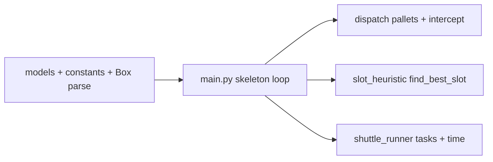

# Optibox structure review and implementation order

## Current repo state

[`/Users/dhirpatel/optibox`](file:///Users/dhirpatel/optibox) is **empty**. The plan below follows your simulation spec without assigning work to numbered developers.

## Structure review (what works well)

- **Separation of concerns**: `models.py` (data) vs a **slot heuristic** module vs a **shuttle runner** vs **pallet/dispatch** logic vs `main.py` (orchestration) keeps scoring, motion, and pallet rules in different files.
- **Single master clock in `main.py`**: The tick sequence (pallet check → inbound → intercept → slot assign → shuttle step → `t += 1`) is the right place for **global ordering**; submodules should not advance time on their own.
- **Decision rules in code**: Storage scoring and trip-duration formulas live in dedicated modules so behavior stays easy to find and test.

## Module naming (no Dev1/2/3)

Use responsibility-based filenames, for example:

| Concern | Suggested module | Role |
|--------|------------------|------|
| Data classes | `models.py` | `Box`, `Slot`, `Shuttle`, `Pallet`, `Silo`, `Dispatcher`; parsing; light helpers |
| `find_best_slot` | `slot_heuristic.py` | Z-axis safety, X distance within lane, overshoot shield |
| Shuttle execution | `shuttle_runner.py` | Task queue, interleaving, scenarios A/B/C, `(10+d)` timing |
| Pallets + intercept | `dispatch.py` (or `pallets.py`) | Up to 8 active pallets, 12-box rule, cross-dock intercept |
| Orchestration | `main.py` | Global loop and `t += 1` |

You can merge any of the three logic modules later if the repo stays small; splitting them early still matches your spec’s boundaries.

## Gaps and decisions to bake in early

1. **Cross-module inputs**: Define stable function signatures early: slot heuristic needs lane, silo read access, inbound destination, optional outbound X for overshoot shield; shuttle runner needs a small task type and a single place that sets busy time / `is_idle`; dispatch needs inventory by destination and active pallet state.
2. **Constants**: Centralize literals (`10`, `20`, `12`, `8`, `32`, grid size) in `constants.py` or a `SimulationConfig` in `models.py`.
3. **Box 20-digit format**: Fix one parser (`parse_box_id` → `Box`) and document digit positions; tests keep random inbound consistent.
4. **Inbound → shuttle mapping**: Define how random feed picks one of the shuttles (aisle + Y) so slot search stays “within that shuttle’s lane.”

## Optional extra

- `tests/` for parser, scoring, trip durations, pallet + intercept edge cases.

## Implementation sequence

| Phase | Deliverable | Why this order |
|--------|----------------|----------------|
| **1** | `models.py`: core types, parsing, minimal grid/inventory helpers | Everything imports this. |
| **2** | `constants.py` + stub `main.py` with the real tick order and `t += 1` | Locks orchestration. |
| **3** | `dispatch.py`: open pallet when count ≥ 12 and active < 8, reserve 12, intercept vs store | First steps of the tick list; independent of slot scoring. |
| **4** | `slot_heuristic.py`: three priorities, X tie-break, overshoot filter | Needs read-only silo + lane + optional outbound X. |
| **5** | `shuttle_runner.py`: idle + queue, A/B/C, durations | Consumes tasks from dispatch + slot choice. |
| **6** | Wire `main.py`: random inbound, dispatch → heuristic → enqueue runner; tick shuttles; metrics/termination | Full simulation. |
| **7** | Tests as above | Regression safety. |

## Spec checks (logic only)

- **Storage heuristic**: Priority 2 placing in Z=2 with both empty is consistent; `+500` vs `+5000` ordering is clear. Overshoot shield needs outbound pick X passed in when interleaving—put that on `find_best_slot` from the start.
- **Shuttle trips**: Scenario A’s sum matches per-leg `(10 + distance)`; use the same rule for B and C.

## Risks

- **Reservation vs storage**: When 12 boxes are reserved for a pallet, the silo must not double-count or let new inbound overwrite committed inventory—define reserved vs in-slot behavior.
- **Shuttle order per tick**: If all shuttles are processed each tick, use a fixed order or document that order affects behavior.

---

**Summary**: Same architecture as your spec, without team labels. Build **models + main skeleton**, then **dispatch → slot heuristic → shuttle runner**, wire `main.py`, add tests. Use boring module names and stable APIs between them.
