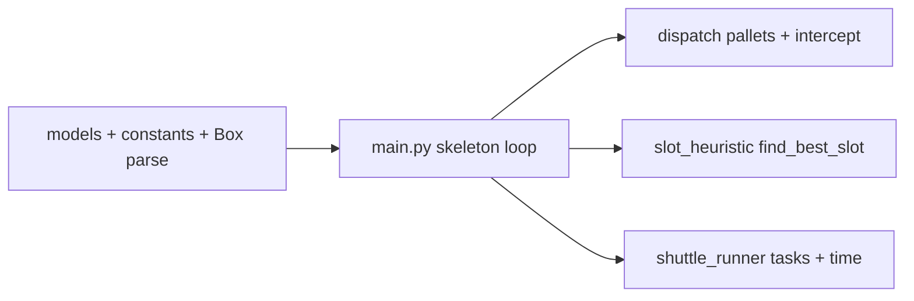

# Optibox structure review and implementation order

## Current repo state

[`/Users/dhirpatel/optibox`](file:///Users/dhirpatel/optibox) is **empty**. The plan below follows your simulation spec without assigning work to numbered developers.

## Corridor shuttle operating model (must-have behavior)

- **Continuous loop at head (`x=0`)**: Every shuttle repeatedly starts by taking one inbound box from the `1000 boxes/hour` feed at `x=0`.
- **Rule 1: Immediate cross-dock when possible**: If that inbound box destination already has an active pallet slot, do not store it. Pick at `x=0` (10s) and drop to pallet at `x=0` (10s).
- **Rule 2: Store while traveling to next outbound**: If inbound cannot be cross-docked, store it on the way to an outbound box that should be shipped (destination with active pallet).
- **Place depth preference**: When storing this inbound box, prefer dropping in `z=2`.
- **Use `z=1` only for destination stacking**: If, on the path to the outbound pick, you pass a location where `z=2` has the same destination as the inbound box you are holding, drop it at `z=1` there (preferred stacking move). Otherwise keep the default `z=2` preference.
- **Cycle repeats from head**: After delivering outbound to `x=0`, shuttle immediately takes the next inbound and repeats the same decision logic.

## Structure review (what works well)

- **Separation of concerns**: `models.py` (data) vs a **slot heuristic** module vs a **shuttle runner** vs **pallet/dispatch** logic vs `main.py` (orchestration) keeps scoring, motion, and pallet rules in different files.
- **Single master clock in `main.py`**: The tick sequence (pallet check → inbound → intercept → slot assign → shuttle step → `t += 1`) is the right place for **global ordering**; submodules should not advance time on their own.
- **Decision rules in code**: Storage scoring and trip-duration formulas live in dedicated modules so behavior stays easy to find and test.

## Time ownership contract (strict)

- **Only `main.py` advances time**: `t += 1` happens exactly once per tick, and only at the end of the global tick sequence.
- **Submodules are tick-local**: `dispatch.py`, `slot_heuristic.py`, and `shuttle_runner.py` compute decisions/state transitions for the current tick only; they never call sleep, run internal time loops, or increment `t`.
- **Duration accounting lives in state, not wall-clock**: Task durations (for example `10 + d`) are stored as remaining tick counters and reduced during `shuttle step` when `main.py` executes that phase.
- **Determinism requirement**: Given the same initial state and random seed, results must be identical. This is enforced by one clock owner and one fixed phase order.

## Module naming (no Dev1/2/3)

Use responsibility-based filenames, for example:

| Concern | Suggested module | Role |
|--------|------------------|------|
| Data classes | `models.py` | `Box`, `Slot`, `Shuttle`, `Pallet`, `Silo`, `Dispatcher`; parsing; light helpers |
| `find_best_slot` | `slot_heuristic.py` | Z-axis safety, X distance within lane, overshoot shield |
| Shuttle execution | `shuttle_runner.py` | Task queue, interleaving, scenarios A/B/C, `(10+d)` timing |
| Pallets + intercept | `dispatch.py` (or `pallets.py`) | Up to 8 active pallets, 12-box rule, cross-dock intercept |
| Orchestration | `main.py` | Global loop and `t += 1` |

You can merge any of the three logic modules later if the repo stays small; splitting them early still matches your spec’s boundaries.

## Gaps and decisions to bake in early

1. **Cross-module inputs**: Define stable function signatures early: slot heuristic needs lane, silo read access, inbound destination, and the selected outbound target (for "store-on-the-way"); shuttle runner needs a small task type and a single place that sets busy time / `is_idle`; dispatch needs inventory by destination and active pallet state.
2. **Constants**: Centralize literals (`10`, `20`, `12`, `8`, `32`, grid size) in `constants.py` or a `SimulationConfig` in `models.py`.
3. **Box 20-digit format**: Fix one parser (`parse_box_id` → `Box`) and document digit positions; tests keep random inbound consistent.
4. **Inbound → shuttle mapping**: Define how random feed picks one of the shuttles (aisle + Y) so slot search stays "within that shuttle's lane."
5. **Corridor slot policy**: Implement "drop in `z=2` by default; but if a same-destination `z=2` is encountered on the way to the outbound pick, drop at `z=1` there" as a hard rule in slot selection.
6. **Cross-dock priority at `x=0`**: Inbound destination with active pallet must bypass storage and go directly to pallet handling.
7. **No hidden clock jumps**: Prohibit helper functions from advancing multiple ticks in one call; each call returns deltas that `main.py` applies within the current tick.

## Optional extra

- `tests/` for parser, scoring, trip durations, pallet + intercept edge cases.

## Implementation sequence

| Phase | Deliverable | Why this order |
|--------|----------------|----------------|
| **1** | `models.py`: core types, parsing, minimal grid/inventory helpers | Everything imports this. |
| **2** | `constants.py` + stub `main.py` with the real tick order and `t += 1` | Locks orchestration. |
| **3** | `dispatch.py`: open pallet when count >= 12 and active < 8, reserve 12, detect "inbound destination has active pallet" | Enables mandatory direct cross-dock at `x=0`. |
| **4** | `slot_heuristic.py`: enforce corridor placement (`z=2` default, promote on-path same-destination stacking at `z=1` over generic `z=2`), X tie-break, on-the-way bias | Needs read-only silo + lane + selected outbound target X. |
| **5** | `shuttle_runner.py`: explicit cycle "take inbound at `x=0` -> cross-dock or store -> pick outbound -> return to `x=0`" with durations | Encodes the continuous shuttle behavior you described. |
| **6** | Wire `main.py`: random inbound, dispatch gate, corridor slot decision, enqueue runner; tick shuttles; metrics/termination | Full simulation with corridor logic active each cycle. |
| **7** | Tests as above | Regression safety. |

## Per-cycle decision flow (corridor logic)

1. Shuttle is at or returns to `x=0`.
2. Pick next inbound box from feed (`10s` handling).
3. If inbound destination has active pallet, drop directly to pallet at `x=0` (`10s`) and finish cycle.
4. Otherwise choose an outbound box to ship (destination with active pallet).
5. While traveling toward that outbound X, drop inbound into a valid slot:
   - First preference: if an on-path location has `z=2` with same destination, drop at `z=1` there.
   - Otherwise, use normal preference: drop in `z=2`.
6. Pick outbound, return to `x=0`, drop for shipping, and immediately start next cycle.

## Spec checks (logic only)

- **Storage heuristic**: Priority 2 placing in Z=2 with both empty is consistent; `+500` vs `+5000` ordering is clear. Overshoot shield needs outbound pick X passed in when interleaving—put that on `find_best_slot` from the start.
- **Shuttle trips**: Scenario A’s sum matches per-leg `(10 + distance)`; use the same rule for B and C.

## Risks

- **Reservation vs storage**: When 12 boxes are reserved for a pallet, the silo must not double-count or let new inbound overwrite committed inventory—define reserved vs in-slot behavior.
- **Shuttle order per tick**: If all shuttles are processed each tick, use a fixed order or document that order affects behavior.

---

**Summary**: Same architecture as your spec, without team labels, now with explicit corridor-cycle behavior: always start from inbound at `x=0`, direct-drop when pallet is available, otherwise store on the way to an outbound pick with strict `z=2`/`z=1` placement rules.
